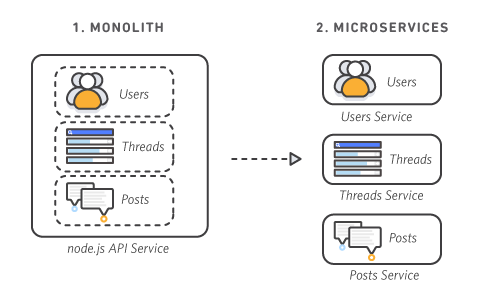

# Microservices architecture
## What is microservices architecture
- often shortened to microservices
- an architectural style for developing applications that allows a large application to be seperated into smaller independent parts, with each part having its own responsibility. (Google Cloud)
    - A collection of self-contained and autonomous services where each servive implements a single business capability/feature within a bounded context. A bounded context is a natural division within a business and an explicit boundary within which a domain model excists.(Microsoft Learn)
    - an architectural and organizational approach to software development where software is composed of small independent service that communicate over well-defined APS. (AWS)

### Specialisation 
- Each service focusses on solving a specific problem. If the service becomes more complex over time, it can be broken into smaller services (AWS)
- Each service is a separate codebase that persists its own data or external state,which means that they can be developed and deployed independently and do not need to share technology stacks, libraries or frameworks (Microsoft Learn)

### Autonomy
- Each microservice is a single service and communicates with other services through simple interfaces (GoogleCloud)
    - Services communicate with each other through APIs, meaning the internal implementation for each service is hidden from other services (Microsoft Learn, AWS)
    - A single user request might call upon many internal microservices to create a response (Google Cloud)
    - Services are small, independent and loosely coupled
- Each service tends to be owned by small, self-contained teams (AWS, Microsoft Learn)
- Each component service can be developed, deployed, operated and scaled without affecting the funcitoning of other services; they do not need to share code or implementation with other services and communication happends via APIs (AWS)

### Components
- Microservices architecture typically include a magement/orchestration component, which is responsible for distributing and balancing services accross nodes, identifying failures, etc. (Microsoft Learn)
- They also tend to include an API gateway as the entry points for clients, so clients do not access individual services directly. They can perform cross-cutting functions such as authentication, logging, SSL termination and load balancing (Microsoft Learn)

        

## Pros and Cons of microservices architecture

### Pros
- speed up application development as each service is deployed independently, so no need to wait for other services that might not be ready to deploy (Google Cloud and Microsoft Learn, AWS)
- small, focused teams that take ownership of their service(s), which promotes agility (faster communication and less management overhead) (Microsoft Learn, AWS)
- small code base, which means less code needs to be updated when writing a new feature (services are all autonomous, so mostly only requires updating within a single service, though keep in mind that dependent services will still need to be able to connect) (Microsoft Learn)
- each service/team can choose its own tech stack, which means they can choose the tech that best first their service and team (Microsoft Learn, AWS)
- fault isolation: failure of an individual microservice should not disrupt the entire application (if well-designed, e.g. with circuit breaker pattern or asynchronous messaging patterns) (Microsoft Learn, AWS)
- service can be scaled independtly, meaning more efficient utilization of resources (Microsoft Learn, AWS)
- As data is specific to each service, updating the data is easier and less risky as it does not affect other services (Microsoft Learn)
- Reusable code: software is divided into small, well-defined modules, which enables teams to use functions for multiple purposes. (AWS)

### Cons
- Though each service in isolation is fairly simple, the application as a whole tends to be quite complex as they have more moving parts than monolithic applications (Microsoft Learn)
- Some services are dependent on other services, and refactoring and testing across service boundaries is more difficult than within a monolithic application (Microsoft Learn)
- If there are too many different tech stacks used the application as a whole becomes hard to maintain. Would be useful to have some project-wide standards without overly restricting team flexibility, especially for cross-cutting functionality such as logging (Microsoft Learn)
- Interservice communication might result in network congestion and latency if the chain of service dependencies gets too long. Requires careful API design with APIs that are not overly chatty (try to use serialization formats and asynchronous communication patters like queue-based load levelling) (Microsoft Learn)
- The independency of service data can make it difficult to maintain data consistency across services where required (Microsoft Learn).
- Requires mature DevOps culture to allow for correlating logging across services (Microsoft Learn)
- Service updates must not break dependent services, so backward and forward compatibility needs to be monitored (Microsoft Learn)

## Example where it could be useful
- Website migration: from monolithic platofrm to cloud-based and container-based microservices platform(Google Cloud)
- Media content: storing images and video in scalable object storage system and serve directly to web or mobile (Google Cloud)
- Payment processing: seprate ordering from payment processing so payments continue to be accepted if invoicing is not working (Google Cloud)
- Online shopping application that separates out e.g.:
    - product catalog management
    - inventory management
    - order management
    - delivery management
    - user management
    - product reccomendations
    - product reviews management
    - ... (Hashmap)

## Comparison with monolithic

| Monolithic | Microservices |
| run as single service | run as multiple services |
| procceses are tightly coupled | processes are loosely coupled |
| Spike in demand causes need for entire app to be rescaled | spike in demand only requires single service(s) to be rescaled |
| Adding or improving features become more difficult as app grows in size | adding or improving features is much easier when app grows in size |
| High risk of application inavailability with single process failure | Low risk of application inavailability with single process failure |   

# References
- Amazon AWS. 2023. What are microservices? Available from [https://aws.amazon.com/microservices/] Last accessed on 13/11/2023
- Google Cloud. 2023. What is microservices architecture? Available from [https://cloud.google.com/learn/what-is-microservices-architecture#:~:text=A%20microservices%20architecture%20is%20a,architecture%20diagrams%20and%20services%20independently.] Last accessed on 10/11/2023
- Singh, Jetindeer. 2018. The What, Why and How of a Microservices Architecture. 8 Keys to Help You Get Started Today. Hashmap, and NTT DATA Company. Available from [https://medium.com/hashmapinc/the-what-why-and-how-of-a-microservices-architecture-4179579423a9] Last accessed on 13/133/2023
- Microsoft Learn. 2023. Microservice architecture style. Available from [https://learn.microsoft.com/en-us/azure/architecture/guide/architecture-styles/microservices] Last accessed on 13/11/2023

